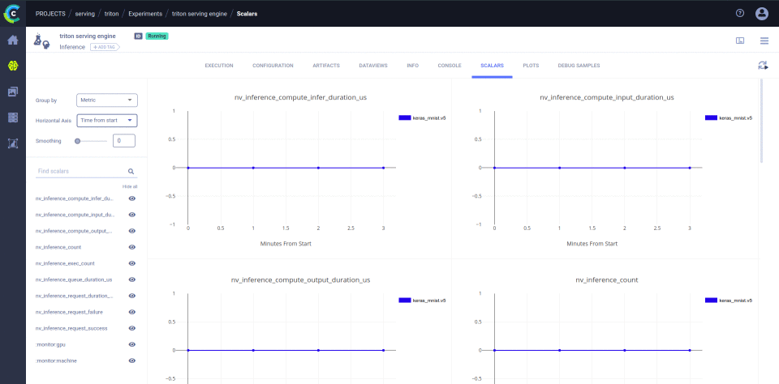

<div align="center">

<a href="https://app.community.clear.ml"></a>

**ClearML Serving - ML-Ops made easy**

## **`clearml-serving` </br> Model-Serving Orchestration and Repository Solution**


[](https://img.shields.io/github/license/allegroai/clearml-serving.svg)
[](https://img.shields.io/pypi/pyversions/clearml-serving.svg)
[](https://img.shields.io/pypi/v/clearml-serving.svg)
[](https://pypi.python.org/pypi/clearml-serving/)
[](https://join.slack.com/t/allegroai-trains/shared_invite/zt-c0t13pty-aVUZZW1TSSSg2vyIGVPBhg)


</div>




**`clearml-serving`** is a command line utility for the flexible orchestration of your model deployment.  
**`clearml-serving`** can make use of a variety of serving engines (**Nvidia Triton, OpenVino Model Serving, KFServing**)
setting them up for serving wherever you designate a ClearML Agent or on your ClearML Kubernetes cluster

Features:
* Spin serving engines on your Kubernetes cluster or ClearML Agent machine from CLI
* Full usage & performance metrics integrated with ClearML UI
* Multi-model support in a single serving engine container
* Automatically deploy new model versions
* Support Canary model releases
* Integrates to ClearML Model Repository
* Deploy & upgrade endpoints directly from ClearML UI
* Programmatic interface for endpoint/versions/metric control


## Installing ClearML Serving

1. Setup your [**ClearML Server**](https://github.com/allegroai/clearml-server) or use the [Free tier Hosting](https://app.community.clear.ml)
2. Connect your ClearML Worker(s) to your **ClearML Server** (see [**ClearML Agent**](https://github.com/allegroai/clearml-agent) / [Kubernetes integration](https://github.com/allegroai/clearml-agent#kubernetes-integration-optional))
3. Install `clearml-serving` (Note: `clearml-serving` is merely a control utility, it does not require any resources for actual serving)
```bash
pip install clearml-serving
```

## Using ClearML Serving

Clearml-Serving will automatically serve *published* models from your ClearML model repository, so the first step is getting a model into your ClearML model repository.  
Background: When using `clearml` in your training code, any model stored by your python code is automatically registered (and, optionally, uploaded) to the model repository. This auto-magic logging is key for continuous model deployment.  
To learn more on training models and the ClearML model repository, see the [ClearML documentation](https://allegro.ai/clearml/docs)

### Training a toy model with Keras (about 2 minutes on a laptop)

The main goal of `clearml-serving` is to seamlessly integrate with the development process and the model repository.
This is achieved by combining ClearML's auto-magic logging which creates and uploads models directly from 
the python training code, with accessing these models as they are automatically added into the model repository using the ClearML Server's REST API and its pythonic interface.  
Let's demonstrate this seamless integration by training a toy Keras model to classify images based on the MNIST dataset. 
Once we have a trained model in the model repository we will serve it using `clearml-serving`.

We'll also see how we can retrain another version of the model, and have the model serving engine automatically upgrade to the new model version. 

#### Keras mnist toy train example (single epoch mock training):

1. install `tensorflow` (and of course `cleamrl`)
   ```bash
   pip install "tensorflow>2" clearml
   ```

2. Execute the training code
   ```bash
   cd examples/keras
   python keras_mnist.py
   ```
   **Notice:** The only required integration code with `clearml` are the following two lines:
   ```python
   from clearml import Task
   task = Task.init(project_name="examples", task_name="Keras MNIST serve example", output_uri=True)
   ```
   This call will make sure all outputs are automatically logged to the ClearML Server, this includes: console, Tensorboard, cmdline arguments, git repo etc.  
   It also means any model stored by the code will be automatically uploaded and logged in the ClearML model repository.  


3. Review the models in the ClearML web UI:  
   Go to the "Projects" section of your ClearML server ([free hosted](https://app.community.clear.ml) or [self-deployed](https://github.com/allegroai/clearml-server)).  
   in the "examples" project, go to the Models tab (model repository).  
   We should have a model named "Keras MNIST serve example - serving_model".  
   Once a model-serving service is available, Right-clicking on the model and selecting "Publish" will trigger upgrading the model on the serving engine container.
   
Next we will spin the Serving Service and the serving-engine

### Serving your models

In order to serve your models, `clearml-serving` will spawn a serving service which stores multiple endpoints and their configuration, 
collects metric reports, and updates models when new versions are published in the model repository.  
In addition, a serving engine is launched, which is the container actually running the inference engine.  
(Currently supported engines are Nvidia-Triton, coming soon are Intel OpenVIno serving-engine and KFServing)

Now that we have a published model in the ClearML model repository, we can spin a serving service and a serving engine.

Starting a Serving Service:  

1. Create a new serving instance.  
   This is the control plane Task, we will see all its configuration logs and metrics in the "serving" project. We can have multiple serving services running in the same system.  
   In this example we will make use of Nvidia-Triton engines.   
```bash
clearml-serving triton --project "serving" --name "serving example"
```
2. Add models to the serving engine with specific endpoints.  
Reminder: to view your model repository, login to your ClearML account, 
   go to "examples" project and review the "Models" Tab
```bash
clearml-serving triton --endpoint "keras_mnist"  --model-project "examples" --model-name "Keras MNIST serve example - serving_model"
```

3. Launch the serving service.  
   The service will be launched on your "services" queue, which by default runs services on the ClearML server machine.  
   (Read more on services queue [here](https://allegro.ai/clearml/docs/docs/concepts_fundamentals/concepts_fundamentals_clearml_server.html#clearml-agent-services-container))  
   We set our serving-engine to launch on the "default" queue, 
```bash
clearml-serving launch --queue default
```

4. Optional: If you do not have a machine connected to your ClearML cluster, either read more on our Kubernetes integration, or spin a bare-metal worker and connect it with your ClearML Server.  
   `clearml-serving` is leveraging the orchestration capabilities of `ClearML` to launch the serving engine on the cluster.  
   Read more on the [ClearML Agent](https://github.com/allegroai/clearml-agent) orchestration module [here](https://allegro.ai/clearml/docs/docs/concepts_fundamentals/concepts_fundamentals_clearml_agent.html)  
   If you have not yet setup a ClearML worker connected to your `clearml` account, you can do this now using:
   ```bash
   pip install clearml-agent
   clearml-agent daemon --docker --queue default --detached
   ```


**We are done!** 
To test the new served model, you can `curl` to the new endpoint:
```bash
curl <serving-engine-ip>:8000/v2/models/keras_mnist/versions/1
```

**Notice**: If we re-run our keras training example and publish a new model in the repository, the engine will automatically update to the new model.

Further reading on advanced topics [here](coming-soon)


